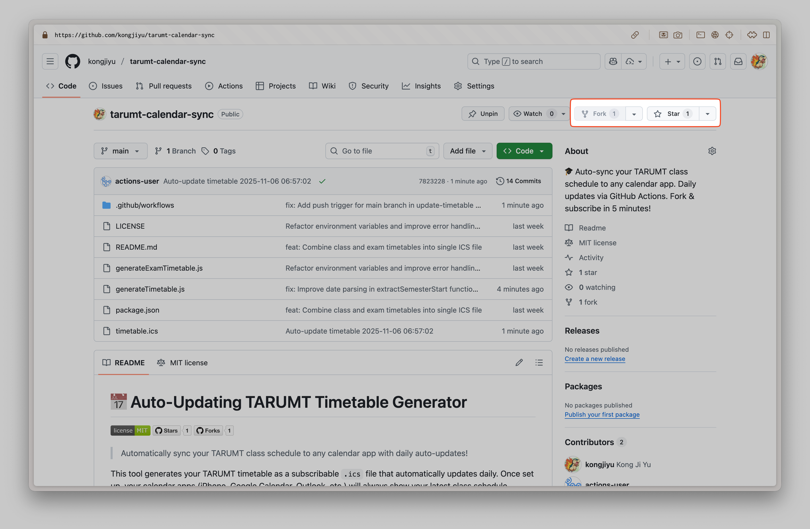
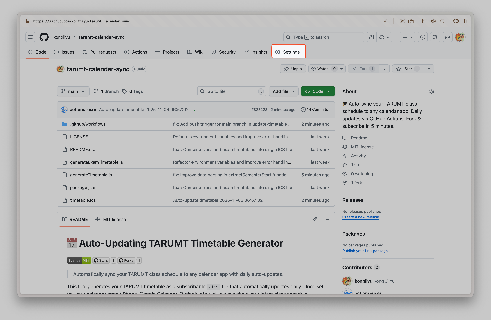
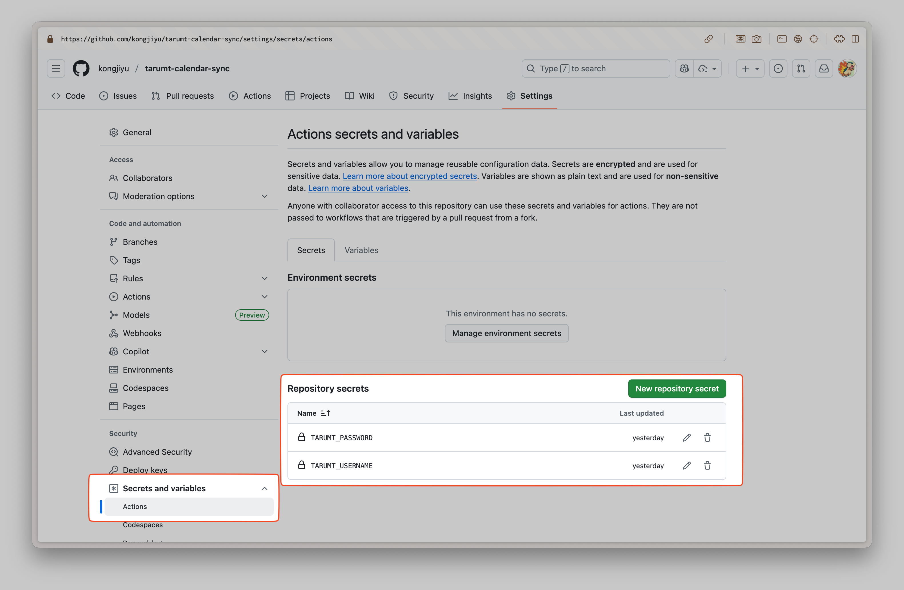
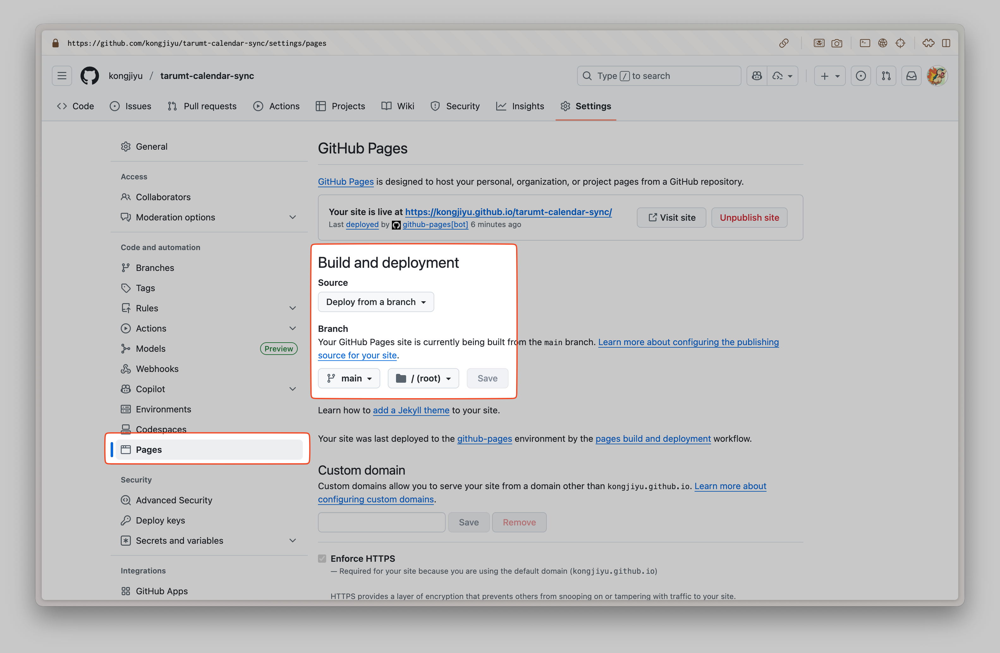
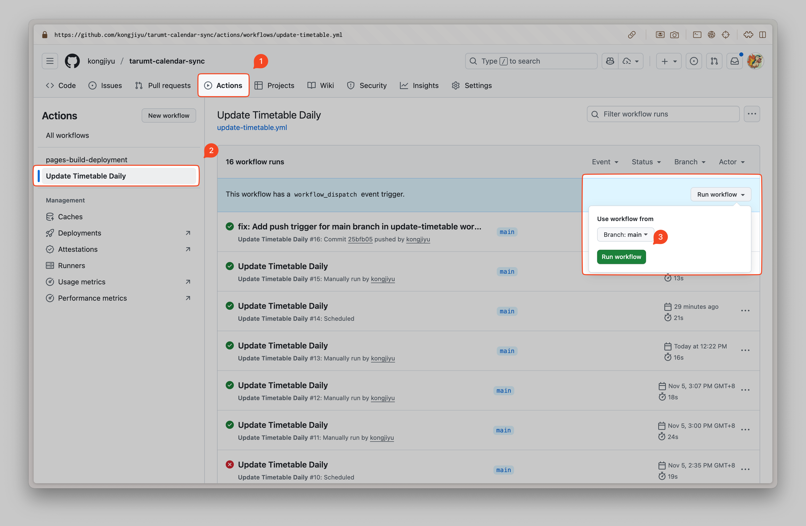

# 📅 TARUMT 自动更新课程表生成器


> 自动同步您的 TARUMT 课程表到任何日历应用，每日自动更新！

[English](README.md) | 简体中文

这个工具可以生成您的 TARUMT 课程表为可订阅的 `.ics` 文件，每天自动更新。设置完成后，您的日历应用（iPhone、Google 日历、Outlook 等）将始终显示最新的课程安排。

**✨ 功能特点：**

- 🔄 每天马来西亚时间早上 6:00 自动更新
- 📚 将课程表和考试时间表合并在一个文件中
- 📱 支持所有主流日历应用
- 🚀 5 分钟即可完成设置
- 🔒 使用 GitHub Secrets 安全存储凭证
- 🆓 100% 免费且开源

---

## 🚀 快速开始指南

### 步骤 1：Fork 此仓库

1. 点击页面右上角的 **Fork** 和 **Star**（如果您喜欢这个项目）按钮
2. 这将创建您自己的仓库副本

   

### 步骤 2：配置 GitHub Secrets

您的 TARUMT 凭证需要安全地存储在 GitHub 中：

1. 前往您 **fork 的仓库** 在 GitHub 上
2. 点击 **Settings** → **Secrets and variables** → **Actions**
3. 点击 **New repository secret**
4. 添加以下两个密钥：


   | 密钥名称          | 值                                     |
   | ----------------- | -------------------------------------- |
   | `TARUMT_USERNAME` | 您的 TARUMT 账号学号（例如：2500001）  |
   | `TARUMT_PASSWORD` | 您的 TARUMT 账号密码（例如：password） |

   **如何添加密钥：**


   - 点击 "New repository secret"
   - Name：`TARUMT_USERNAME`
   - Secret：您的实际 TARUMT 用户名
   - 点击 "Add secret"
   - 重复以上步骤添加 `TARUMT_PASSWORD`

> ⚠️ **安全提示**：您的凭证已加密，永不暴露。它们仅由 GitHub Actions 用于获取您的课程表。



### 步骤 3：启用 GitHub Pages

这使您的课程表文件可公开访问，供日历订阅：

1. 在您的仓库中，前往 **Settings** → **Pages**
2. 在 **Source** 下，选择：
   - **Deploy from a branch**
   - Branch：`main`
   - Folder：`/ (root)`
3. 点击 **Save**
4. 等待约 1 分钟完成部署



### 步骤 4：获取您的订阅链接

启用 GitHub Pages 后，您的日历订阅链接将是：

```
https://您的GITHUB用户名.github.io/tarumt-calendar-sync/timetable.ics
```

**示例：**
如果您的 GitHub 用户名是 `johnsmith`，链接将是：

```
https://johnsmith.github.io/tarumt-calendar-sync/timetable.ics
```

### 步骤 5：测试工作流

在订阅之前，让我们确保一切正常：

1. 前往仓库中的 **Actions** 标签
2. 点击 **Update Timetable Daily** 工作流
3. 点击 **Run workflow** → **Run workflow**
4. 等待完成（绿色勾号 ✅）
5. 检查 `timetable.ics` 文件是否出现在您的仓库中

   

---

## 📱 订阅您的课程表

工作流成功运行后，在您的日历应用中订阅：

### Apple 日历（iPhone/Mac）

**iPhone/iPad：**

1. 打开 **设置** → **日历** → **账户**
2. 点击 **添加账户** → **其他** → **添加已订阅的日历**
3. 粘贴您的订阅链接
4. 点击 **下一步** → **存储**
5. 建议：设置刷新频率为"每小时"

**Mac：**

1. 打开 **日历** 应用
2. **文件** → **新建日历订阅**
3. 粘贴您的订阅链接
4. 点击 **订阅**
5. 设置自动刷新为 **每小时**

### Google 日历

1. 打开 [Google 日历](https://calendar.google.com)
2. 在左侧边栏，点击"其他日历"旁边的 **+**
3. 选择 **通过网址添加**
4. 粘贴您的订阅链接
5. 点击 **添加日历**

> 注意：Google 日历可能需要最多 24 小时才能同步

### Microsoft Outlook

**Outlook 桌面版：**

1. **文件** → **账户设置** → **账户设置**
2. **Internet 日历** 标签 → **新建**
3. 粘贴您的订阅链接 → **添加**
4. 给它命名并点击 **确定**

**Outlook.com：**

1. 点击 **添加日历** → **从 Web 订阅**
2. 粘贴您的订阅链接
3. 命名您的日历并点击 **导入**

---

## ⚙️ 工作原理

### 自动更新

GitHub Action 工作流自动运行：

- **每天** **马来西亚时间早上 6:00**
- 从 TARUMT 门户获取最新的课程表
- 获取您的考试安排（如果有）
- 将两者合并到一个 `.ics` 文件中
- 通过 GitHub Pages 发布

您的日历应用将自动刷新并显示最新的课程安排，包括考试！

### 手动更新

您也可以手动触发更新：

1. 前往 **Actions** 标签
2. 选择 **Update Timetable Daily**
3. 点击 **Run workflow** → **Run workflow**

---

## 🛠️ 本地开发（可选）

如果您想在本地测试或生成课程表：

### 设置

1. 克隆您 fork 的仓库：

   ```bash
   git clone https://github.com/您的用户名/tarumt-calendar-sync.git
   cd tarumt-calendar-sync
   ```
2. 安装依赖：

   ```bash
   npm install
   ```
3. 在项目根目录创建 `.env` 文件：

   ```env
   TARUMT_USERNAME=您的学号
   TARUMT_PASSWORD=您的密码
   ```

### 命令

```bash
# 生成合并的课程表（课程 + 考试）
npm run generate

# 旧版：仅生成考试时间表
npm run generate-exam
```

生成的 `.ics` 文件将在 macOS 上自动打开。

> **注意：** 主要的 `timetable.ics` 文件现在包含课程和考试两者，因此您通常只需订阅一个日历！

---

## 📂 生成的文件


| 文件                 | 描述                                                         |
| -------------------- | ------------------------------------------------------------ |
| `timetable.ics`      | **主文件** - 合并的课程表和考试时间表（订阅此文件！）        |
| `exam_timetable.ics` | 旧版仅考试文件（如果运行`npm run generate-exam` 则单独生成） |

---

## 🔧 故障排除

### GitHub Actions 中工作流失败

**检查凭证：**

- 前往 **Settings** → **Secrets and variables** → **Actions**
- 验证 `TARUMT_USERNAME` 和 `TARUMT_PASSWORD` 是否设置正确
- 如需要，重新添加它们

**没有课程表数据：**

- 如果学期尚未开始或考试未安排，这是正常的
- 工作流将成功完成并生成可用的内容
- 学期开始后将显示课程
- 考试安排后将显示考试

### 日历未更新

**Apple 日历：**

- 右键点击日历 → **刷新**
- 检查订阅设置（应设置为"每天"）

**Google 日历：**

- Google 每 24 小时刷新一次订阅的日历
- 请耐心等待，或删除并重新添加订阅

**Outlook：**

- 右键点击日历 → **更新**

### 无法访问订阅链接

**检查 GitHub Pages：**

- Settings → Pages → 确保已启用并部署
- 链接应该是：`https://您的用户名.github.io/tarumt-calendar-sync/timetable.ics`

**仓库必须是公开的：**

- 私有仓库需要 GitHub Pro 才能使用 Pages
- 确保您的仓库在 Settings 中设置为 Public

---

## 💡 提示和最佳实践

1. **保持仓库公开** - 免费使用 GitHub Pages 所必需
2. **不要分享您的凭证** - 它们在 GitHub Secrets 中已加密
3. **定期检查 Actions 标签** - 确保每日更新正常工作
4. **手动刷新日历应用** - 如果手动运行工作流后需要立即更新
5. **Fork，不要克隆** - Fork 使从原始仓库获取更新更容易

---

## 🤝 与同学分享

您的同学可以 fork 此仓库并按照相同步骤创建他们自己的自动更新课程表！

或者，如果您想与他人分享您的课程表：

```
https://您的用户名.github.io/tarumt-calendar-sync/timetable.ics
```

他们可以订阅此链接以查看您的课程安排（适用于小组项目或学习会话）。

---

## 🔒 隐私与安全

- **凭证已加密** - GitHub Secrets 已加密，永不暴露
- **课程表是公开的** - `.ics` 文件通过 GitHub Pages 公开访问
- **无敏感数据** - 仅分享课程安排，不包括成绩或个人信息
- **您控制访问** - 您可以随时将仓库设为私有（需要 GitHub Pro 才能使用 Pages）

---

## 📜 许可证

此项目根据 MIT 许可证授权 - 详情请参见 [LICENSE](LICENSE) 文件。

**这意味着：**

- ✅ 可自由使用、修改和分发
- ✅ 可用于商业用途
- ✅ 不提供保证
- ⚠️ 必须包含原始许可证和版权声明

---

## 🆘 需要帮助？

- 查看上面的[故障排除](#-故障排除)部分
- 在 **Actions** 标签中查看您的 GitHub Actions 日志
- 确保您的 TARUMT 凭证正确
- 验证 GitHub Pages 已启用并部署

---

**为 TARUMT 学生用 ❤️ 制作**
